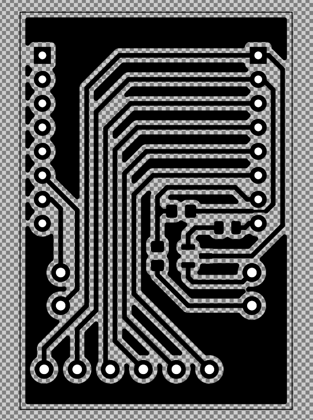
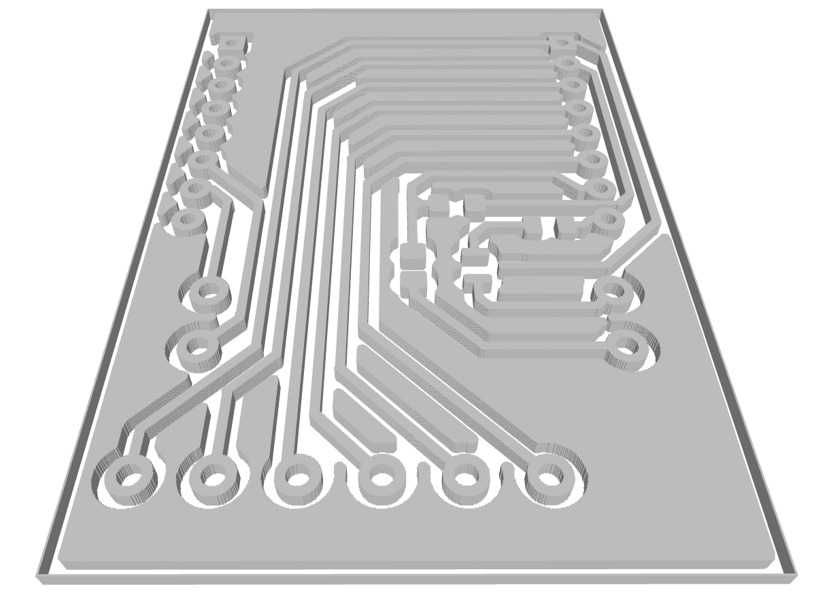

# SVG to STL Converter





Скрипт на Python для преобразования SVG-файлов (в частности, негативных масок печатных плат, экспортированных из KiCad) в 3D-модели формата STL для фотополимерной печати.

## Описание

Этот инструмент автоматизирует процесс преобразования SVG-файлов, экспортированных из KiCad (с черной заливкой, представляющей негатив маски печатной платы), в точные 3D-модели в формате STL для использования с фотополимерными принтерами, такими как Photon Mono X6KS.

## Установка и запуск

### Вариант 1: Готовые бинарные файлы

Скачайте готовый исполняемый файл для вашей операционной системы из [раздела релизов](https://github.com/YOURNAME/svg-to-stl/releases):

- **macOS**: svg2stl-macos
- **Linux**: svg2stl-linux

После скачивания:
- **macOS/Linux**: Сделайте файл исполняемым (`chmod +x svg2stl-*`) и затем запустите его через терминал

> **Примечание для пользователей Linux**: Бинарные файлы скомпилированы на старых системах Linux (Ubuntu 20.04) для максимальной совместимости с большинством дистрибутивов. Если всё же возникают ошибки, используйте метод запуска из исходного кода.

### Вариант 2: Запуск из исходного кода

Требуется Python 3.7 или выше и следующие пакеты:
```
numpy
cairosvg
pillow
numpy-stl
tqdm
```

Установка зависимостей:
```
pip install -r requirements.txt
```

Запуск:
```
python svg2stl.py input.svg --thickness 1.0 --pixel_size 0.025
```

## Особенности

- Преобразование SVG-файлов в высококачественные 3D-модели STL
- Точное определение и извлечение только черных элементов из SVG (трасс и контуров плат)
- Автоматическая обрезка до фактических границ содержимого, значительно уменьшающая размер модели
- Продвинутая оптимизация 3D-модели с объединением смежных пикселей в минимальное количество прямоугольников
- Обработка отдельных файлов или всех SVG-файлов в каталоге
- Настраиваемые параметры для толщины и размера пикселя (разрешения)
- Автоматический расчет оптимального DPI для растеризации на основе размера пикселя
- Индикатор прогресса для отслеживания процесса конвертации

## Использование

### Параметры:

- `--thickness`: Толщина результирующей 3D-модели в мм (по умолчанию: 1.0)
- `--pixel_size`: Размер каждого пикселя в мм (по умолчанию: 0.025). Определяет разрешение растеризации и детализацию модели
- `--debug`: Сохранять отладочные изображения для проверки
- `--all`: Обработать все SVG-файлы в текущем каталоге
- `--inverted`: Извлекать белые пиксели вместо черных (полезно для негативных изображений или светлых элементов на темном фоне)


## Примеры

Преобразование экспорта медного слоя KiCad в STL толщиной 0.8 мм с высоким разрешением (1200 DPI):
```
python svg2stl.py board-F_Cu.svg --thickness 0.8
```

Обработка белых элементов из SVG вместо черных (для негативных/инвертированных дизайнов):
```
python svg2stl.py negative-design.svg --thickness 1.0 --inverted
```

Обработка файла со средним разрешением (600 DPI) для ускорения обработки:
```
python svg2stl.py --all --thickness 1.0 --pixel_size 0.05
```

Быстрая обработка большого файла с более низким разрешением (300 DPI):
```
python svg2stl.py large-board.svg --thickness 1.0 --pixel_size 0.1
```

Сохранение отладочного изображения для проверки обрезки:
```
python svg2stl.py board-F_Cu.svg --thickness 1.0 --debug
```

### Примеры файлов

[caretaker-F_Cu.svg](caretaker-F_Cu.svg) > [caretaker-F_Cu.stl](caretaker-F_Cu.stl)